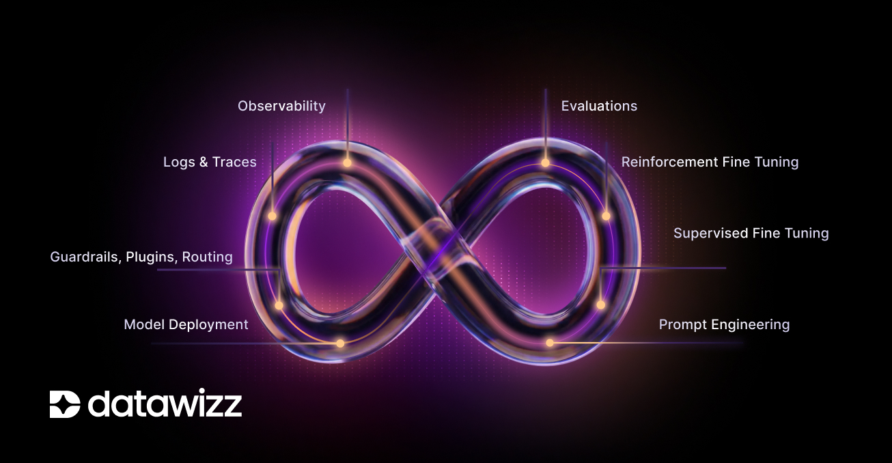
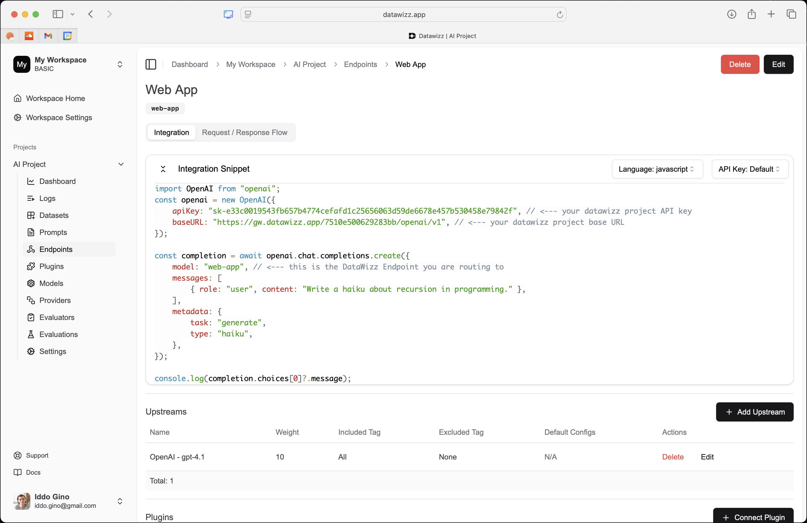
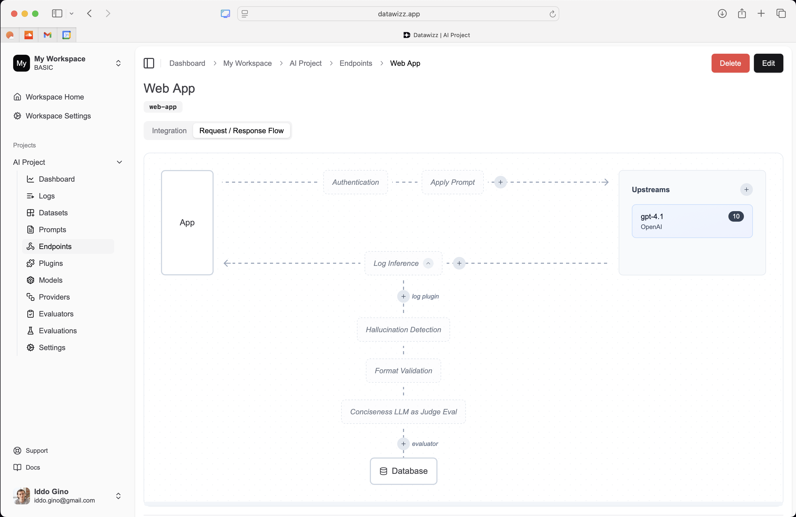
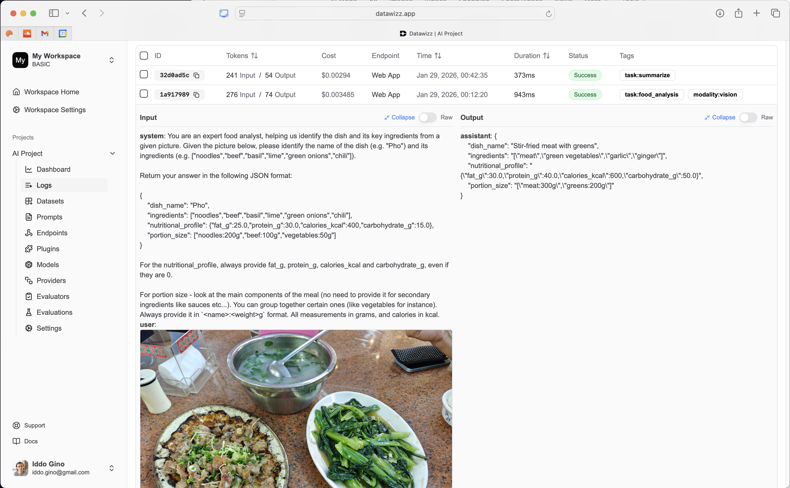
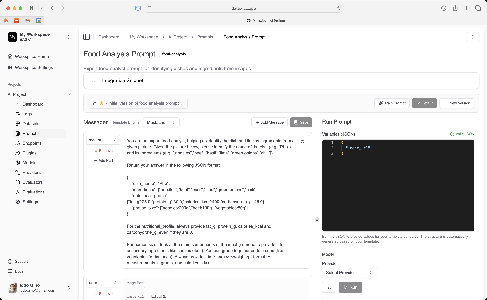
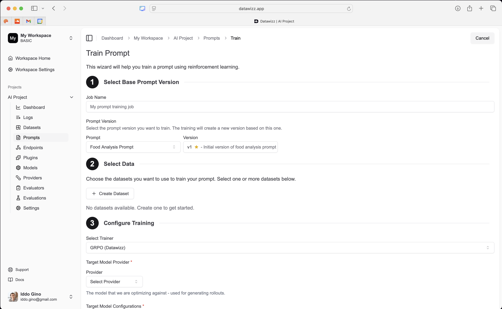
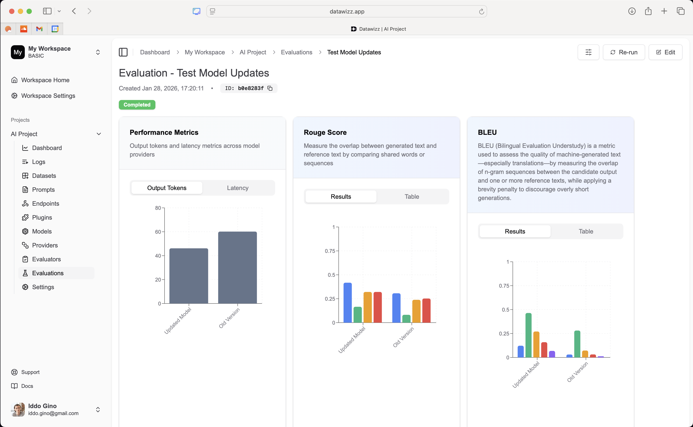
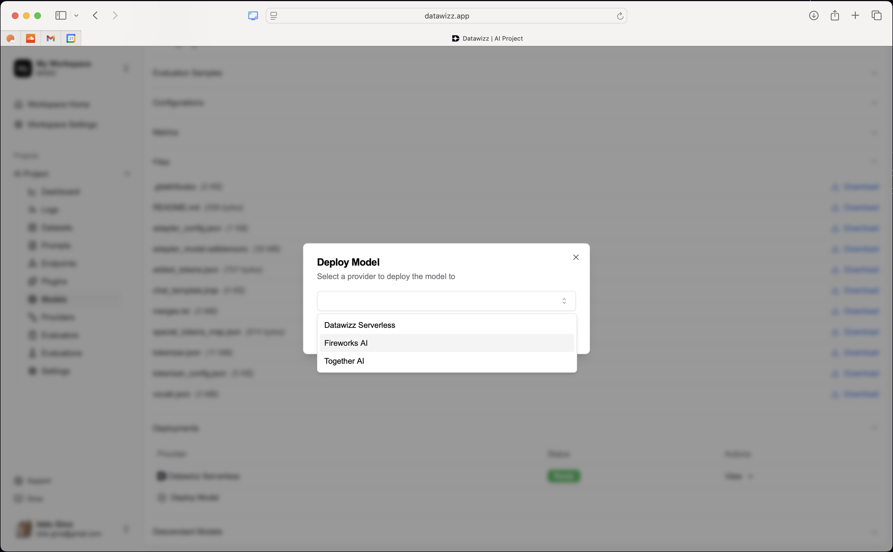
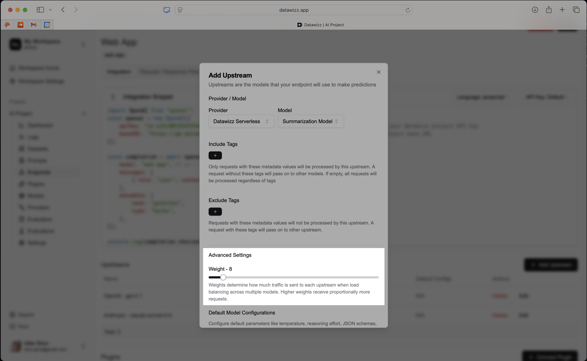

Traditional post-training is handled as a discrete linear process: collect labaled data, train a model, evaluate it and deploy it. Models trained in that approach can quickly become stale as new data and use cases emerge. Continuous learning enables models to evolve over time by incorporating new data and feedback, allowing them to adapt to changing environments and improve their performance continuously. Datawizz makes it easy to close the loop and keep your models up to date with fresh data.

## The Continuous Learning Loop

- **Logs and Traces**: continious learning starts with collecting runtime data - including LLM call logs, traces, and user feedback. This data captures how the model is being used in real-world scenarios.
- **Observability**: using the collected data, understand model performance, identify failure modes, and detect areas for improvement.
- **Prompt Engineering**: refine and optimize prompts based on insights from observability to improve model responses. Use manual adjustments or automated prompt tuning techniques.
- **Supervised Fine Tuning**: leverage the collected data to fine-tune models on specific tasks or domains. This can involve training on new datasets derived from logs and traces, helping the model adapt to evolving requirements.
- **Reinforcement Fine Tuning**: incorporate user feedback and reward signals to further refine model behavior. This helps align the model with user expectations and desired outcomes.
- **Evaluations**: after each adjustment (prompt changes, fine-tuning), evaluate the model's performance against a mixture of golden datsets and real-world data to ensure improvements are realized.
- **Deployment**: deploy the updated model into production, replacing or augmenting the previous version. Monitor its performance continuously to ensure it meets desired standards.
- **Guardrails, Plugins and Routing**: implement guardrails, plugins, and routing mechanisms to ensure the model operates safely and effectively in production environments. These tools help manage risks and enhance the model's capabilities.

**Repeat the cycle: continuous learning is an iterative process. Regularly repeat the loop to keep the model up to date and responsive to changing needs.**

## Continuous Learning with Datawizz
Datawizz enables the entire continious learning cycle - letting you close the loop faster, ship updates more quickly, and maintain high model performance over time. The key insight is connecting runtime data collection & augmentation with model training and evaluation. In this section, we'll walk you through setting up your Datawizz project for continuous learning.

### 1 - Data Collection - Logs, Online Evals and User Feedback
The first step in continuous learning is collecting runtime data. Datawizz automatically captures LLM call logs - simply route your LLM calls through Datawizz and the logs will be stored in your project:

**>> Get started with routing your LLM calls through Datawizz in our [Quickstart Guide](/quickstart).**

Beyond LLM call logs, we recommend collecting online evaluations and user feedback signals. Datawizz supports online evals that can be run in real-time as part of your application flow. You can also collect user feedback (e.g. thumbs up/down, ratings, comments) to capture qualitative insights on model performance.

Online evaluators can be configured in your Datawizz endpoint, and run automatically on every LLM log (asynchronously):

**>> Learn more about setting up [Online Evaluations](/evaluation/custom-evaluators).**

User feedback can be collected via your application and sent to Datawizz using our API. We recomment capturing **explicit feedback** (e.g. user ratings) as well as **implicit feedback** (e.g. user behavior signals like re-tries, time spent, etc).

**>> Learn more about sending [User Feedback to Datawizz](/logs/feedback).**

### 2 - Observability - Monitor Model Performance
The Datawizz Dashboard let's you monitor model performance over time using the collected logs, online evals, and user feedback. Use the dashboard to identify failure modes, track key metrics, and uncover areas for improvement.

You can also drill down into individual logs to understand specific model behaviors and issues:

**>> Learn more about [Managing Logs in Datawizz](/logs/metadata-and-tagging).**

### 3 - Prompt Engineering - Refine Prompts Based on Insights
Use Datawizz to experiement with prompt engineering based on insights from observability. You can create and test different prompt variations directly in the Datawizz dashboard:

**>> Check out recent updates on [Prompt Management in Datawizz](https://datawizz.ai/blog/leveling-up-prompt-management-with-liquid-templates).**

Datawizz also lets you automatically tune prompts based on logs, custom evaluators and user feedback. This helps optimize prompt performance over time:

### 4 + 5 - Fine Tuning - Supervised and Reinforcement Learning
Datawizz makes it easy to fine-tune your models using the collected data. You can create fine-tuning datasets directly from logs, online evals, and user feedback and launch fine-tuning jobs in just a few clicks:

**>> Learn more about [Fine-Tuning Models with Datawizz](/models/fine-tuning).**

### 6 - Evaluations - Continuous Testing and Validation
After each model update (prompt changes, fine-tuning), use Datawizz to evaluate model performance against a mix of golden datasets and real-world data. Datawizz lets you set up evaluation jobs and use custom evaluators to validate results - either defined in code (Python) or using LLM as Judge.

**>> Learn more about [Automated Evaluations in Datawizz](/evaluation/automated-evaluations).**

### 7 - Deployment - Seamless Model Updates
Once you've validated model improvements, deploy the updated model directly from Datawizz

**>> Learn more about [Model Deployment with Datawizz](/models/model-deployment).**

Datawizz also enables gradual rollouts and A/B testing to safely deploy new models and monitor their performance in production. You can route a percentage of traffic to the new model version and compare results against the previous version. Simply adjust weights for the different models in the endpoint upstream settings:

**>> Learn more about [Model Routing and Weighting](/endpoints/routing).**

### 8 - Guardrails, Plugins and Routing - Safe and Effective Operations
Datawizz helps you farther enchance model performance and safety in production using guardrails, plugins, and routing mechanisms.
- **[Plugins & Guardrails](/plugins/plugins)** let you extend model capabilities and enforce safety constraints.
- **[Routing](/endpoints/routing)** enables intelligent request routing based on input characteristics, user segments, or other criteria.

### ∞ - Rinse and Repeat
Continuous learning is an iterative process. Regularly repeat the loop to keep your models up to date and responsive to changing needs. Datawizz provides all the tools you need to close the loop faster and maintain high model performance over time.
For model fine tuning - Datawizz lets you re-train models on fresh data as it comes in. Simply create new fine-tuning datasets from the latest logs and feedback, and launch new fine-tuning jobs using older models as the base, to continiously adapt to new data.

## Setting Up for Success with Continuous Learning

There are a few best practices to keep in mind when implementing continuous learning with Datawizz:

- **Invest in Evaluators**: robust evaluators are critical for measuring model performance and guiding improvements. Invest time in developing high-quality custom evaluators that capture key aspects of your use cases.
    - Datawizz let's you define a set of custom evaluators that can be used across online evals, fine-tuning datasets, and evaluation jobs. This ensures consistency in how you measure performance throughout the continuous learning loop.
    - Crafting evaluators is where you should likely be spending most of your time - they are the foundation for effective continuous learning.
- **Leverage User Feedback**: user feedback is a valuable source of insights for continuous learning. Make it easy for users to provide feedback and incorporate it into your learning loop.
    - Collect both explicit feedback (ratings, comments) and implicit feedback (user behavior signals).
    - Use feedback to inform prompt engineering, fine-tuning datasets, and evaluation criteria.
- **Use rich Metadata and Tagging**: Datawizz supports extensive metadata and tagging capabilities. Use these features to organize and filter logs, datasets, and models effectively.
    - Tag logs with relevant context (e.g. user segments, use cases) to facilitate targeted analysis and dataset creation.
    - Use metadata to track model versions, fine-tuning parameters, and evaluation results.