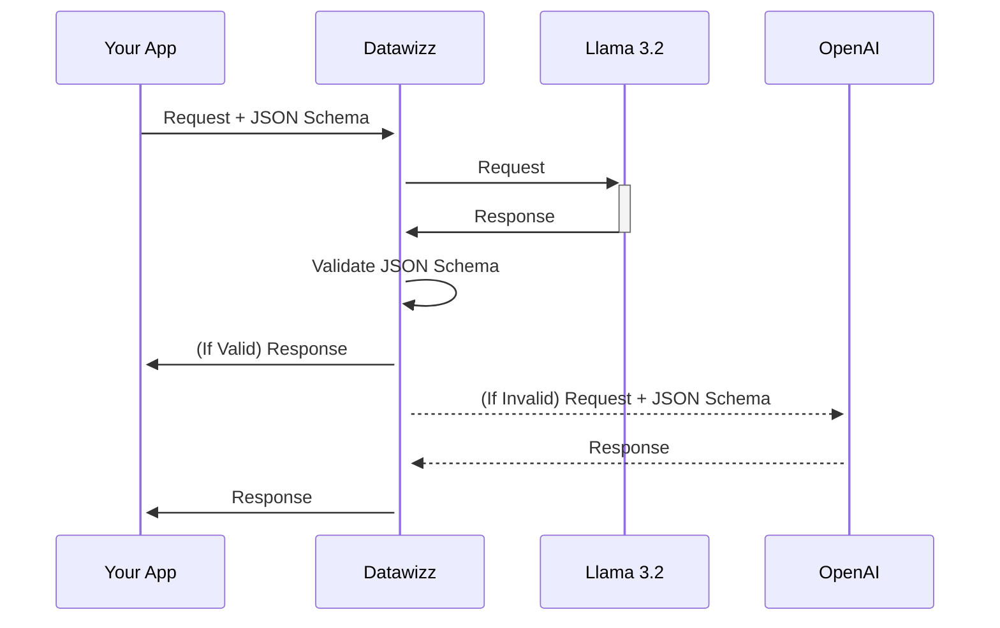

Certain models and providers have the ability to generate stuctured outputs - JSON responses that adhere to a specific schema. This can be useful for downstream applications that expect a specific format for the response.

Datawizz extands support for Structured Output in two key ways:

1. For models that support structured output, Datawizz will pass your JSON Schema to leverage the built-in validation capabilities of the model.
2. Additionally, Datawizz can independenly validate the output of the model against the JSON Schema you provide. This is usefull for models that don't support structured output.

This is particularly powerful when combined with [routing fallbacks](/endpoints/routing). You can route requests to a smaller model that doesn't support structured output, then Datawizz will test the output, and if it isn't valid - route it to a larger model that does support structured output.

This is a common scenario with Llama 3.2 models - which don't support structured output, but have good results for data extraction. You can route requests to them, test the output on datawizz, and if it's not valid - route it to an OpenAI model that does support structured output.



## Configuring Structured Outputs

To use Datawizz Structured output validation, turn on the JSON Validation option at the end point level. This will run JSON validation if a JSON Schema is supplied in the request, and fail the request if the model response fails validation.


To send a JSON Schema, use the OpenAI style API described here: [https://platform.openai.com/docs/guides/structured-outputs](https://platform.openai.com/docs/guides/structured-outputs)

Here's an example request with a JSON Schema:

```bash
curl -X "POST" "http://localhost:8787/***********/openai/v1/chat/completions" \
     -H 'Authorization: Bearer sk-***********' \
     -H 'Content-Type: application/json' \
     -d $'{
        "messages": [
            {"role": "system", "content": "You are a helpful assistant."},
            {"role": "user", "content": "Return the population, area, country, and name of the city."}
    ],
    "model": "***********",
    "response_format": {
        "type": "json_schema",
        "json_schema": {
            "strict": true,
            "name": "extract_city_data",
            "description": "Return ONLY a JSON object describing the city with the following keys: name, country, population, area.",
            "schema": {
                "properties": {
                    "country": {
                        "type": "string",
                        "description": "The country the city is in."
                    },
                    "area": {
                        "type": "number",
                        "description": "City area in KM as a numeric value with up to two decimal places."
                    },
                    "name": {
                        "type": "string",
                        "description": "The city name."
                    },
                    "population": {
                        "type": "number",
                        "description": "The city\'s population as a numeric value."
                    }
                },
                "type": "object",
                "required": [
                    "name",
                    "country",
                    "population",
                    "area"
                ],
                "additionalProperties": false
            }
        }
    },
    "max_completion_tokens": 1024
}'
```