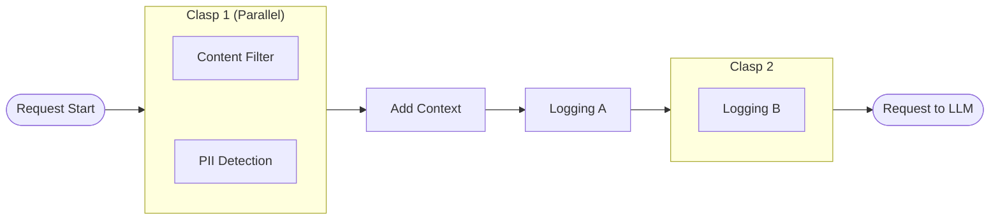
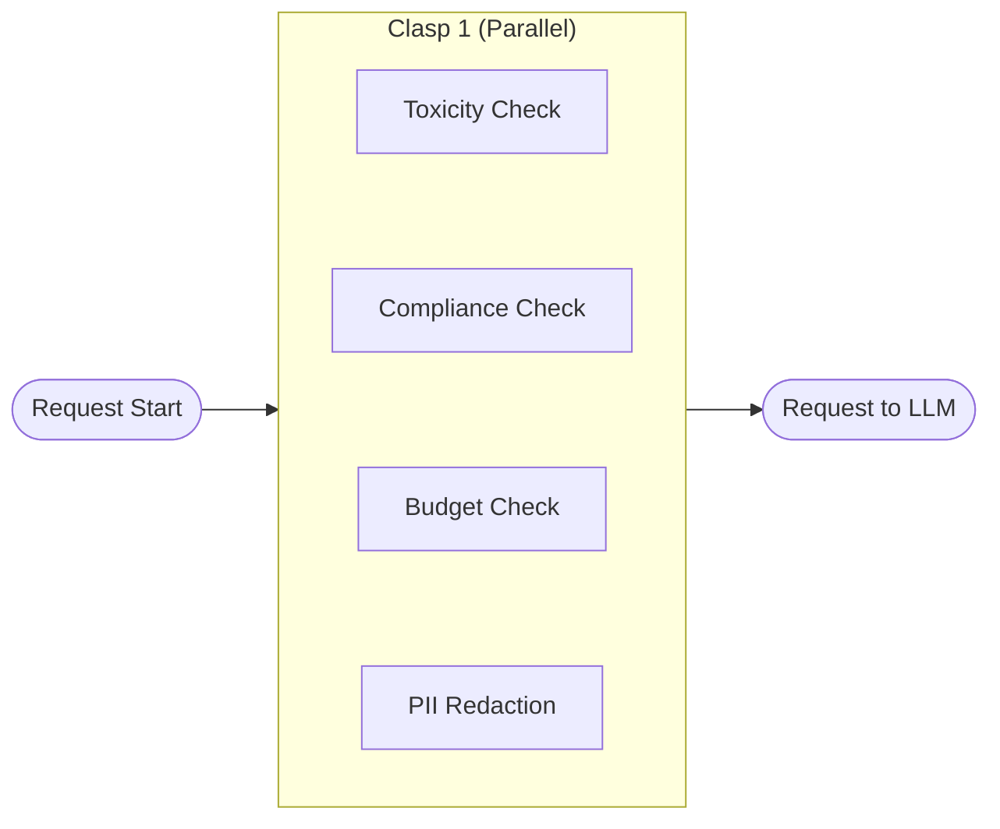
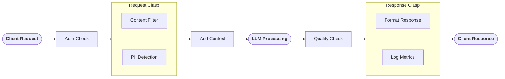

Plugins are custom code modules that can intercept and process requests and responses flowing through your AI Gateway. They provide a powerful extension mechanism for implementing custom logic such as content filtering, data transformation, compliance checks, and request enrichment.

Plugins execute at specific points in the request lifecycle (called "phases") and can either allow requests/responses to proceed, reject them with custom reasons, or modify the message contents before passing them along to the next stage.

---

## Guardrail Plugins

Guardrail plugins act as safety gates, screening requests and responses to ensure they meet your security, compliance, and quality standards before proceeding.

### How Guardrails Work

A guardrail plugin evaluates incoming requests (before they reach the LLM) or outgoing responses (before they're returned to the client) and can:

- **Allow**: Let the request/response continue through the pipeline by returning `{ reject: false }`
- **Reject**: Block the request/response by returning `{ reject: true, rejectReason: "..." }`

When a guardrail rejects a request or response:
- The rejection reason is logged for audit purposes
- The client receives an error response with the rejection reason
- The request never reaches the LLM (for REQUEST phase) or the response never reaches the client (for RESPONSE phase)
- No further plugins in the pipeline are executed

### Use Cases

Common guardrail scenarios include:

- **Content Safety**: Screen for prohibited content, PII, or sensitive information
- **Compliance**: Enforce regulatory requirements (GDPR, HIPAA, etc.)
- **Quality Control**: Reject low-quality or malformed responses
- **Policy Enforcement**: Validate requests against business rules
- **Toxicity Detection**: Filter out harmful or offensive content
- **Budget Protection**: Reject requests that would exceed token limits

### Example Response

```json
{
  "reject": true,
  "rejectReason": "Content contains PII that violates data privacy policy"
}
```

---

## Modification Plugins

Modification plugins transform the messages array as it flows through the pipeline, enabling sophisticated data manipulation and enrichment.

### How Modifications Work

A modification plugin receives the current messages array and can return a modified version:

```json
{
  "reject": false,
  "messages": [
    { "role": "user", "content": "Modified user message" },
    { "role": "assistant", "content": "Modified assistant response" }
  ]
}
```

When a plugin returns modified messages:
- The modified messages become the input for the next plugin in the pipeline
- Multiple plugins can chain modifications together
- If no `messages` array is returned, the original messages are passed unchanged

### Use Cases

Common modification scenarios include:

- **Content Anonymization**: Redact or pseudonymize PII in messages
- **Prompt Enhancement**: Add context, instructions, or examples to user prompts
- **Translation**: Convert messages to different languages
- **Format Normalization**: Standardize message structure or content
- **Response Enrichment**: Add metadata, citations, or structured data to responses
- **Token Optimization**: Compress or summarize long messages

### Example Response

```json
{
  "reject": false,
  "messages": [
    {
      "role": "system",
      "content": "You are a helpful assistant. Always cite your sources."
    },
    {
      "role": "user",
      "content": "What is the capital of France?"
    }
  ]
}
```

---

## Using Plugins

Plugins are connected to endpoints through the endpoint configuration. You can attach multiple plugins to an endpoint, each executing at a specific phase of the request lifecycle.

### Plugin Sources

Datawizz provides two ways to use plugins:

1. **Public Plugins**: Pre-built plugins provided by Datawizz for common use cases (content filtering, PII detection, etc.)

2. **Custom Plugins**: Build your own plugins to implement custom business logic - see [Building Custom Plugins](./build-custom-plugins) for details.

### Connecting Plugins in the Dashboard


To connect a plugin to an endpoint:

1. Navigate to your endpoint configuration in the dashboard
2. Select the "Plugins" tab
3. Click "Add Plugin"
4. Choose between public plugins or project (custom) plugins
5. Configure the plugin settings (see Endpoint Plugin Configuration below)
6. Save your endpoint configuration

---

## Endpoint Plugin Configuration

Each plugin attached to an endpoint can be configured with the following settings:

### Core Settings

| Field | Type | Default | Description |
|-------|------|---------|-------------|
| `phase` | `REQUEST` \| `RESPONSE` \| `LOG` | Required | Execution phase for the plugin |
| `priority` | `number` | `0` | Execution order (lower number = earlier execution) |
| `async` | `boolean` | `false` | Whether plugin executes asynchronously (non-blocking) |
| `configs` | `object` | `{}` | Custom configuration passed to your plugin |

### Reliability Settings

| Field | Type | Default | Description |
|-------|------|---------|-------------|
| `retry_on_error` | `number` | `0` | Number of retry attempts on plugin failure (max: 10) |
| `timeout` | `number` | `60` | Maximum execution time in seconds before timeout |

### Phase Options

- **REQUEST**: Executes after prompt templates are applied, before the request is sent to the LLM
- **RESPONSE**: Executes after receiving the LLM response, before returning to client
- **LOG**: Executes during the logging phase (non-blocking, for analytics/monitoring)

> **Note:** REQUEST phase plugins receive the messages array _after_ prompt templates have been applied and variables have been interpolated. This means plugins work with the final messages that will be sent to the LLM.

---

## Execution Order

Understanding plugin execution order is crucial for building reliable and predictable pipelines.

### Priority-Based Ordering

Plugins execute in ascending priority order (lower numbers first):

```
Priority 0 → Priority 10 → Priority 20 → Priority 100
```

Plugins with the same priority will execute in a non-deterministic order.

### Async Execution (Clasps)

Plugins marked as `async: true` can execute in parallel with other async plugins that have consecutive priorities. This is called "clasping."

This is a great way to reduce latency by executing multiple plugins in parallel.

> **Note:** Clasping only allows for rejections - async plugins cannot modify the messages array or return additional data (we do this because in async execution, if multiple plugins modify the messages array, it's not clear which one should take precedence or how to merge the results).

**Clasping Rules:**
- Consecutive async plugins at the same or adjacent priorities are grouped into a "clasp"
- All plugins in a clasp execute simultaneously
- The gateway waits for all plugins in a clasp to complete before proceeding
- A non-async plugin breaks the clasp, forcing sequential execution

### Example 1: Mixed Async and Sync Plugins

| Plugin | Priority | Async | Execution |
|--------|----------|-------|-----------|
| Content Filter | 0 | ✅ | **Clasp 1** |
| PII Detection | 1 | ✅ | **Clasp 1** |
| Add Context | 2 | ❌ | Sequential |
| Logging A | 3 | ❌ | Sequential |
| Logging B | 4 | ✅ | **Clasp 2** |




### Example 2: All Async Plugins

| Plugin | Priority | Async | Execution |
|--------|----------|-------|-----------|
| Toxicity Check | 0 | ✅ | **Clasp 1** |
| Compliance Check | 0 | ✅ | **Clasp 1** |
| Budget Check | 0 | ✅ | **Clasp 1** |
| PII Redaction | 0 | ✅ | **Clasp 1** |



### Example 3: Request and Response Flow

| Phase | Plugin | Priority | Async |
|-------|--------|----------|-------|
| REQUEST | Auth Check | 0 | ❌ |
| REQUEST | Content Filter | 10 | ✅ |
| REQUEST | PII Detection | 10 | ✅ |
| REQUEST | Add Context | 20 | ❌ |
| RESPONSE | Quality Check | 0 | ❌ |
| RESPONSE | Format Response | 10 | ✅ |
| RESPONSE | Log Metrics | 10 | ✅ |




### Rejection Behavior

When a plugin rejects a request or response:
- Execution stops immediately
- No subsequent plugins in the pipeline are executed
- The rejection reason is logged
- An error response is returned to the client

---

## Considerations & Best Practices

### Latency Impact

Every plugin adds latency to your request pipeline. Consider these strategies to minimize impact:

**✅ Do:**
- Use `async: true` for independent guardrails (toxicity, PII, compliance checks)
- Set appropriate `timeout` values based on plugin complexity
- Use LOG phase for non-critical operations like analytics
- Place critical guardrails early in the pipeline (low priority numbers)
- Cache plugin results when possible within your plugin implementation

**❌ Avoid:**
- Long-running synchronous plugins in the REQUEST phase
- Multiple sequential modification plugins that could be combined
- Plugins that make unnecessary external API calls
- Setting timeout values higher than needed

### Stability & Reliability

Plugin failures can impact your entire pipeline. Follow these best practices:

**Error Handling:**
- Set `retry_on_error` for plugins that call external services (recommended: 2-3 retries)
- Use appropriate `timeout` values to prevent hanging requests
- Currently, plugin failures default to "pass-through" behavior (the request continues)
- Monitor plugin logs to track failure rates

**Testing:**
- Test plugins in isolation before adding to production pipelines
- Verify plugin behavior with various message types and edge cases
- Load test your plugin endpoints to ensure they can handle production traffic
- Monitor plugin execution times and adjust timeouts accordingly

**Observability:**
- Plugins automatically log execution time, rejection status, and debug messages
- Use the `debug` array in plugin responses to add custom debugging information
- Monitor plugin logs for errors, timeouts, and unexpected behavior

### Security

**Authentication:**
- Use the `headers` field to add authentication tokens to plugin requests
- Store sensitive credentials securely, not in configuration files
- Rotate API keys and tokens regularly

**Network Security:**
- Use HTTPS for all plugin URLs
- Validate SSL certificates
- Implement rate limiting on your plugin endpoints
- Consider using VPNs or private networks for sensitive plugins

### Performance Optimization

**Async Execution:**
- Mark independent guardrails as `async: true` to enable parallel execution
- Group related async plugins with the same priority for clasping
- Be cautious with async modification plugins - they cannot modify each other's results

**Priority Optimization:**
- Place rejection-likely guardrails early (low priority) to fail fast
- Place expensive operations later (high priority) so they only run if needed
- Use LOG phase for non-blocking operations like metrics and analytics

**Resource Management:**
- Monitor plugin execution times and optimize slow plugins
- Set realistic timeouts to prevent resource exhaustion
- Consider implementing circuit breakers in your plugin infrastructure

### Message Modification

**Chaining:**
- Modifications chain sequentially - each plugin receives the previous plugin's output
- Ensure modification plugins return valid message arrays
- Test modification chains thoroughly to avoid unexpected transformations

**Validation:**
- Validate modified messages match the expected schema
- Ensure role types remain valid (user, assistant, system)
- Preserve important metadata when modifying messages

### Cost Considerations

- Plugin execution incurs additional compute and network costs
- External API calls in plugins may have their own costs
- Balance the value of plugin functionality against added costs
- Consider caching strategies to reduce redundant plugin executions
