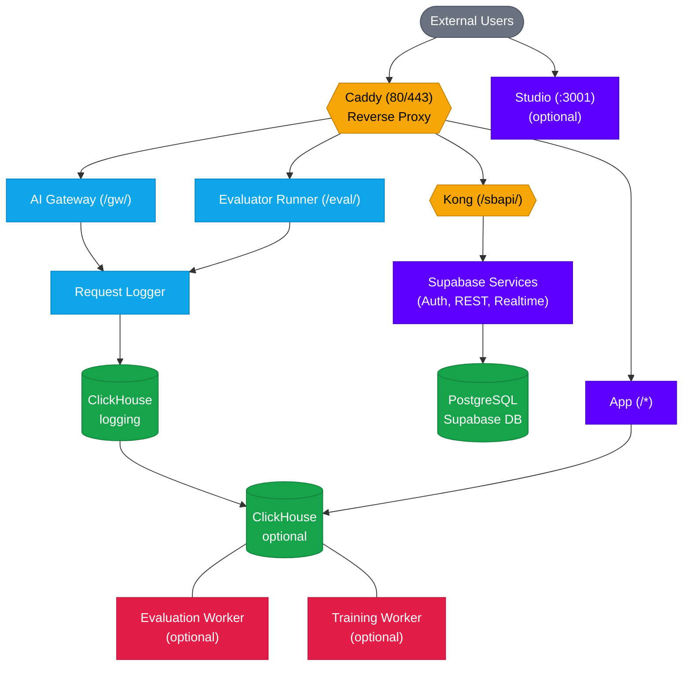

<Info>
  Self hosting is an enterprise-only feature. Please contact us at [enterprise@datawizz.ai](mailto:enterprise@datawizz.ai) to get started.
</Info>

Datawizz provides a Docker Compose file for running the entire platform on a single machine or cloud instance. This is the recommended initial deployment for testing and proof-of-concept.

## Hardware Requirements

At a minimum, the training component requires a machine with an **A100**, **H100**, or **H200** GPU.

In cloud environments, we recommend the following instance types as a minimum:

| Cloud Provider | Instance Type |
|----------------|---------------|
| AWS | `p5.4xlarge` |
| Azure | `Standard_NC40ads_H100_v5` |
| GCP | `a2-ultragpu-1g` |

## Scaling the Deployment

Typically, we scale the deployment by breaking out several components from the single instance into separate instances or managed services, in this order:

<CardGroup cols={3}>
  <Card title="ClickHouse DB" icon="database" href="/self-host/scaling-clickhouse">
    Scale out ClickHouse to a dedicated instance for data redundancy and performance.
  </Card>
  <Card title="Router & Logger" icon="route" href="/self-host/scaling-gateway">
    Run the AI Gateway, Request Logger, and Evaluator Runner on separate instances for horizontal scaling.
  </Card>
  <Card title="Inference Workers" icon="microchip" href="/self-host/scaling-inference">
    Deploy inference workers separately for easier horizontal scaling and autoscaling.
  </Card>
</CardGroup>

## Quick Start

```bash
# 1. Add hostname to /etc/hosts (required - 'localhost' doesn't work)
echo "127.0.0.1 datawizz.local" | sudo tee -a /etc/hosts

# 2. Configure environment
cd self-deploy
cp .env.example .env
# Edit .env with your values (especially passwords and JWT_SECRET)

# 3. Start services
docker compose up -d                           # Minimal (app + supabase)
docker compose --profile clickhouse up -d      # With local ClickHouse
docker compose --profile gateway up -d         # With AI Gateway + Logger + Evaluator
docker compose --profile studio up -d          # With Supabase Studio
docker compose --profile full up -d            # Everything

# 4. Access
open http://datawizz.local                     # Datawizz App
open http://datawizz.local:3001                # Supabase Studio (if enabled)
open http://datawizz.local/gw                  # AI Gateway (if enabled)
```

<Note>
  `localhost` cannot be used due to Docker networking constraints. The app container needs to reach the host machine, which requires a resolvable hostname mapped via `/etc/hosts`.
</Note>

## Architecture



## Profiles

Docker Compose profiles allow you to selectively enable optional services:

| Profile | Services | Use Case |
|---------|----------|----------|
| (none) | Core Supabase + App | Minimal deployment with external ClickHouse |
| `clickhouse` | + ClickHouse | Local ClickHouse instance |
| `gateway` | + AI Gateway, Request Logger, Evaluator Runner, ClickHouse | LLM inference proxy with logging |
| `studio` | + Supabase Studio | Database management UI |
| `workers` | + Evaluation/Training Workers | Local GPU workers (requires NVIDIA GPU) |
| `full` | All services | Complete local deployment |

### Usage Examples

```bash
# Minimal: App + Supabase (using external ClickHouse)
docker compose up -d

# With local ClickHouse
docker compose --profile clickhouse up -d

# With AI Gateway (includes ClickHouse for logging)
docker compose --profile gateway up -d

# With Supabase Studio for database management
docker compose --profile studio up -d

# Multiple profiles
docker compose --profile clickhouse --profile studio up -d

# Everything (requires NVIDIA GPU for workers)
docker compose --profile full up -d

# Using environment variable
COMPOSE_PROFILES=clickhouse,studio docker compose up -d
```

## Configuration

### Required Environment Variables

Edit `.env` and configure at minimum:

| Variable | Description |
|----------|-------------|
| `POSTGRES_PASSWORD` | PostgreSQL password |
| `JWT_SECRET` | JWT signing secret (min 32 chars) |
| `ANON_KEY` | Supabase anonymous API key |
| `SERVICE_ROLE_KEY` | Supabase service role key |

### Generating Secure Values

```bash
# Generate JWT_SECRET (32+ characters)
openssl rand -base64 32

# Generate SECRET_KEY_BASE (64+ characters)
openssl rand -base64 64

# Generate random tokens
openssl rand -hex 16
```

### External Services

To use external managed services instead of local containers:

**External ClickHouse** (see [Scaling Out ClickHouse](/self-host/scaling-clickhouse) for full details):
```bash
# In .env (don't enable clickhouse profile)
CLICKHOUSE_HOST=your-clickhouse-host.example.com
CLICKHOUSE_PORT=8443
CLICKHOUSE_USER=your_user
CLICKHOUSE_PASSWORD=your_password
CLICKHOUSE_DATABASE=datawizz
```

### AI Gateway

For running the gateway on separate instances, see [Scaling Out the Router & Logger](/self-host/scaling-gateway).

The `gateway` profile enables a complete LLM inference proxy stack:

| Service | Description | URL |
|---------|-------------|-----|
| **AI Gateway** | Proxies LLM requests, handles routing, caching | `http://{domain}/gw/{project}/{endpoint}/...` |
| **Request Logger** | Batches and stores inference logs | Internal only |
| **Evaluator Runner** | Runs custom evaluators on inference results | `http://{domain}/eval/...` |

**How it works:**
1. Clients send LLM requests to the AI Gateway
2. Gateway routes requests to configured model providers
3. Responses are logged via the Request Logger to ClickHouse
4. Evaluators can automatically score inference results

**Configuration:**
```bash
# Gateway caching
GATEWAY_CACHE_TTL=3600              # Config cache TTL (seconds)
GATEWAY_LOGGER_BATCH_SIZE=10        # Logs per batch
GATEWAY_LOGGER_FLUSH_INTERVAL=5000  # Flush interval (ms)

# Feedback JWT (optional - for secure feedback without API key)
GATEWAY_FEEDBACK_JWT_ENABLED=false
GATEWAY_FEEDBACK_JWT_SECRET=your-secret-min-32-chars
```

### Using Pre-built Images

By default, `docker compose up` builds images from local source code. For production deployments, you can use pre-built images from a container registry instead.

**Configure image sources in `.env`:**
```bash
DATAWIZZ_APP_IMAGE=ghcr.io/datawizz/app:v1.0.0
AI_GATEWAY_IMAGE=ghcr.io/datawizz/ai-gateway:v1.0.0
REQUEST_LOGGER_IMAGE=ghcr.io/datawizz/request-logger:v1.0.0
EVALUATOR_RUNNER_IMAGE=ghcr.io/datawizz/evaluator-runner:v1.0.0
EVALUATION_WORKER_IMAGE=ghcr.io/datawizz/evaluation-worker:v1.0.0
TRAINING_WORKER_IMAGE=ghcr.io/datawizz/training-worker:v1.0.0
```

**Pull and run without building:**
```bash
# Pull the pre-built images
docker compose pull

# Start services without building
docker compose up -d --no-build

# Or combine into one command
docker compose pull && docker compose up -d --no-build
```

<Note>
  If you omit `--no-build`, Docker Compose will attempt to build from source even if the image variables are set.
</Note>

## URL Routing

Caddy routes requests based on URL path:

| Path | Destination | Description |
|------|-------------|-------------|
| `/sbapi/*` | Kong → Supabase | Supabase API (auth, database, storage) |
| `/gw/*` | AI Gateway | LLM inference proxy (gateway profile) |
| `/eval/*` | Evaluator Runner | Evaluator testing (gateway profile) |
| `/*` | Datawizz App | Main application (catch-all) |

**Direct access (not via Caddy):**
- Supabase Studio: `http://{domain}:3001` (studio profile)

## Production Deployment

### Enable HTTPS

For production, set your domain in `.env`:

```bash
DOMAIN=datawizz.yourdomain.com
```

Caddy will automatically provision SSL certificates via Let's Encrypt.

### Security Checklist

- Change all default passwords in `.env`
- Generate secure `JWT_SECRET` (min 32 chars)
- Generate new `ANON_KEY` and `SERVICE_ROLE_KEY`
- Set `DOMAIN` to your actual domain
- Review `DISABLE_SIGNUP` setting
- Configure SMTP for email delivery

## Common Operations

### View Logs

```bash
# All services
docker compose logs -f

# Specific service
docker compose logs -f datawizz-app

# Multiple services
docker compose logs -f datawizz-app kong auth
```

### Restart Services

```bash
# Single service
docker compose restart datawizz-app

# All services
docker compose restart
```

### Update Services

```bash
# Pull latest images and restart
docker compose pull
docker compose up -d
```

### Upgrading / Re-running Migrations

Database migrations run automatically on first startup. They won't re-run on subsequent `docker compose up` calls (Docker caches completed containers).

**When to re-run migrations:**
- After pulling a new version with database schema changes
- After changing ClickHouse connection settings in `.env`
- If migrations failed and you've fixed the issue

**How to re-run migrations:**

```bash
# Force re-run all migrations
docker compose up -d --force-recreate supabase-migrations clickhouse-migrations

# Or re-run just PostgreSQL migrations
docker compose up -d --force-recreate supabase-migrations

# Check migration logs
docker compose logs supabase-migrations
docker compose logs clickhouse-migrations
```

### Check Service Health

```bash
docker compose ps
```

### Access Database

```bash
# PostgreSQL
docker exec -it supabase-db psql -U postgres

# ClickHouse (if enabled)
docker exec -it datawizz-clickhouse clickhouse-client
```

## Backup & Restore

### Quick Backup

```bash
# PostgreSQL
docker exec supabase-db pg_dump -U postgres -d postgres -F c | \
  gzip > backups/postgres-$(date +%Y%m%d-%H%M%S).dump.gz

# File storage
tar -czvf backups/storage-$(date +%Y%m%d-%H%M%S).tar.gz ./volumes/storage
```

## Troubleshooting

### Services won't start

1. Check logs: `docker compose logs`
2. Verify `.env` file exists and has required values
3. Check Docker daemon is running

### Database connection errors

1. Wait for database to be healthy: `docker compose ps`
2. Check PostgreSQL logs: `docker compose logs db`
3. Verify `POSTGRES_PASSWORD` in `.env`

### App shows "initializing" or errors

1. Migrations may still be running - wait a few seconds
2. Check migration logs: `docker compose logs supabase-migrations`
3. Verify Kong is healthy: `docker compose logs kong`

### Workers fail to start

1. Workers require NVIDIA GPU with Docker GPU support
2. Verify GPU is available: `nvidia-smi`
3. Check Docker GPU runtime: `docker run --rm --gpus all nvidia/cuda:11.0-base nvidia-smi`

### Gateway services not responding

1. Check all gateway services are healthy: `docker compose ps | grep -E "gateway|logger|evaluator"`
2. Restart Caddy to pick up new routes: `docker compose restart caddy`
3. Test internal connectivity: `docker exec datawizz-caddy wget -qO- http://ai-gateway:3000/health`
4. Check gateway logs: `docker compose logs ai-gateway request-logger evaluator-runner`

### SSL certificate issues (production)

1. Ensure domain DNS points to your server
2. Check Caddy logs: `docker compose logs caddy`
3. Ports 80 and 443 must be accessible from the internet
