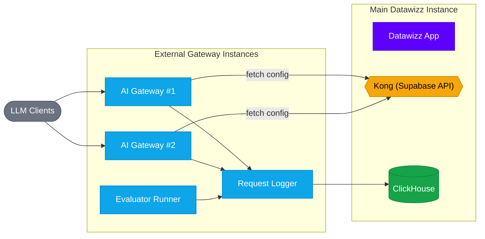

The AI Gateway (router), Request Logger, and Evaluator Runner are lightweight services that handle incoming LLM requests, log them, and run evaluations. By default they run inside the main Docker Compose setup via the `gateway` profile. For production, you can break them out to separate instances for horizontal scaling and maximum uptime.

## Architecture Overview

When scaled out, the gateway services run independently and connect back to the main Datawizz instance for configuration:



## Running the AI Gateway

The AI Gateway fetches its configuration (projects, endpoints, prompts) from the Datawizz API via Supabase. It caches configurations in-memory and uses Supabase Realtime for instant cache invalidation when configurations change in the dashboard.

### Docker Run

```bash
docker run -d \
    --name datawizz-gateway \
    -p 3000:3000 \
    -e DW_API_URL="http://your-datawizz-host/sbapi" \
    -e DW_API_KEY="your-service-role-key" \
    -e DW_CACHE_TTL="3600" \
    -e DW_LOGGER_URL="http://your-logger-host:3000" \
    -e DW_LOGGER_API_KEY="your-service-role-key" \
    -e DW_LOGGER_BATCH_SIZE="10" \
    -e DW_LOGGER_FLUSH_INTERVAL_MS="5000" \
    -e DWGW_PORT="3000" \
    -e DWGW_HOST="0.0.0.0" \
    -e DWGW_CORS_ENABLED="true" \
    -e DWGW_CORS_ALLOW_ORIGIN="*" \
    -e DWGW_OPTIONS_ENABLED="true" \
    ghcr.io/datawizzai/ai-gateway-cf:latest
```

### Environment Variables

| Variable | Description | Default |
|----------|-------------|---------|
| `DW_API_URL` | URL to the Datawizz Supabase API (e.g. `http://datawizz-host/sbapi`) | Required |
| `DW_API_KEY` | Supabase service role key | Required |
| `DW_CACHE_TTL` | Config cache TTL in seconds | `3600` |
| `DW_LOGGER_URL` | URL of the Request Logger service | Required |
| `DW_LOGGER_API_KEY` | API key for the logger | Required |
| `DW_LOGGER_BATCH_SIZE` | Number of logs per batch | `10` |
| `DW_LOGGER_FLUSH_INTERVAL_MS` | Flush interval in milliseconds | `5000` |
| `DWGW_PORT` | Port to listen on | `3000` |
| `DWGW_HOST` | Host to bind to | `0.0.0.0` |
| `DWGW_CORS_ENABLED` | Enable CORS headers | `false` |
| `DWGW_CORS_ALLOW_ORIGIN` | Allowed CORS origins | `*` |
| `DWGW_OPTIONS_ENABLED` | Handle OPTIONS preflight requests | `false` |
| `DWGW_FEEDBACK_JWT_ENABLED` | Enable JWT tokens for feedback auth | `false` |
| `DWGW_FEEDBACK_JWT_SECRET` | Secret for signing feedback JWTs (min 32 chars) | — |
| `DWGW_FEEDBACK_JWT_EXPIRATION` | Feedback JWT expiration in seconds | `86400` |

### Cache Invalidation

The gateway subscribes to Supabase Realtime for automatic cache invalidation. When you update a project, endpoint, or prompt in the Datawizz dashboard, all gateway instances invalidate their cached data within seconds.

If the Realtime connection fails, the gateway continues operating normally and cached entries expire based on the TTL setting.

### Health Check

The gateway exposes a health endpoint at `/health`:

```bash
curl http://your-gateway-host:3000/health
# {"status": "ok"}
```

## Running the Request Logger

The Request Logger batches inference logs and writes them to ClickHouse. It also forwards results to the Evaluator Runner for automated scoring.

```bash
docker run -d \
    --name datawizz-request-logger \
    -p 3000:3000 \
    -v logger-data:/app/data \
    -e PORT="3000" \
    -e DATA_DIR="/app/data" \
    -e SUPABASE_URL="http://your-datawizz-host/sbapi" \
    -e SUPABASE_SERVICE_ROLE_KEY="your-service-role-key" \
    -e CLICKHOUSE_URL="http://your-clickhouse-host:8123" \
    -e CLICKHOUSE_DATABASE="datawizz" \
    -e CLICKHOUSE_USERNAME="your_user" \
    -e CLICKHOUSE_PASSWORD="your_password" \
    -e DISABLE_AUTH="false" \
    -e EVALUATOR_RUNNER_API_URL="http://your-evaluator-host:3000" \
    -e EVALUATOR_RUNNER_API_KEY="your-evaluator-key" \
    ghcr.io/datawizzai/logging-service:latest
```

| Variable | Description | Default |
|----------|-------------|---------|
| `PORT` | Port to listen on | `3000` |
| `DATA_DIR` | Directory for local data/buffer | `/app/data` |
| `SUPABASE_URL` | Datawizz Supabase API URL | Required |
| `SUPABASE_SERVICE_ROLE_KEY` | Supabase service role key | Required |
| `CLICKHOUSE_URL` | ClickHouse HTTP URL | Required |
| `CLICKHOUSE_DATABASE` | ClickHouse database name | `default` |
| `CLICKHOUSE_USERNAME` | ClickHouse username | `default` |
| `CLICKHOUSE_PASSWORD` | ClickHouse password | `default` |
| `DISABLE_AUTH` | Disable auth for internal networks | `true` |
| `EVALUATOR_RUNNER_API_URL` | Evaluator Runner URL | — |
| `EVALUATOR_RUNNER_API_KEY` | Evaluator Runner API key | — |

## Running the Evaluator Runner

The Evaluator Runner executes custom evaluators on inference results.

```bash
docker run -d \
    --name datawizz-evaluator-runner \
    -p 3000:3000 \
    -e PORT="3000" \
    -e ENVIRONMENT="production" \
    -e JWT_SECRET="your-jwt-secret" \
    -e API_KEYS="your-evaluator-key" \
    -e SUPABASE_URL="http://your-datawizz-host/sbapi" \
    -e SUPABASE_SERVICE_KEY="your-service-role-key" \
    ghcr.io/datawizzai/evaluator-runner-cf:latest
```

| Variable | Description | Default |
|----------|-------------|---------|
| `PORT` | Port to listen on | `3000` |
| `ENVIRONMENT` | Environment name | `local` |
| `JWT_SECRET` | JWT secret (must match main instance) | Required |
| `API_KEYS` | Comma-separated API keys for service-to-service auth | Required |
| `SUPABASE_URL` | Datawizz Supabase API URL | Required |
| `SUPABASE_SERVICE_KEY` | Supabase service role key | Required |

## Updating the Main Instance

After deploying the gateway services externally, update the `.env` on the main Datawizz instance so the app knows where to find them:

```bash
# Point the app to the external gateway and evaluator
NEXT_PUBLIC_GATEWAY_BASE_URL=http://your-gateway-host:3000
NEXT_PUBLIC_EVALUATOR_TEST_API_URL=http://your-evaluator-host:3000
```

Then disable the `gateway` profile and restart the app:

```bash
# Start without the gateway profile (services are external now)
docker compose up -d

# Or restart just the app if already running
docker compose restart datawizz-app
```

<Note>
  If you had previously used the `gateway` profile, stop and remove the local gateway containers: `docker compose --profile gateway down`.
</Note>

## Horizontal Scaling

You can run multiple instances of the AI Gateway behind a load balancer for high availability. Each instance independently fetches and caches configuration from the Datawizz API, so no shared state is needed between gateway nodes.

A typical setup:
1. Run 2+ AI Gateway containers across separate machines
2. Place them behind a load balancer (e.g. AWS ALB, Nginx, Caddy)
3. All gateway instances point to the same Request Logger (or a logger cluster)
4. The Request Logger writes to ClickHouse

The gateway is stateless and lightweight, so it scales horizontally with minimal resource overhead.
